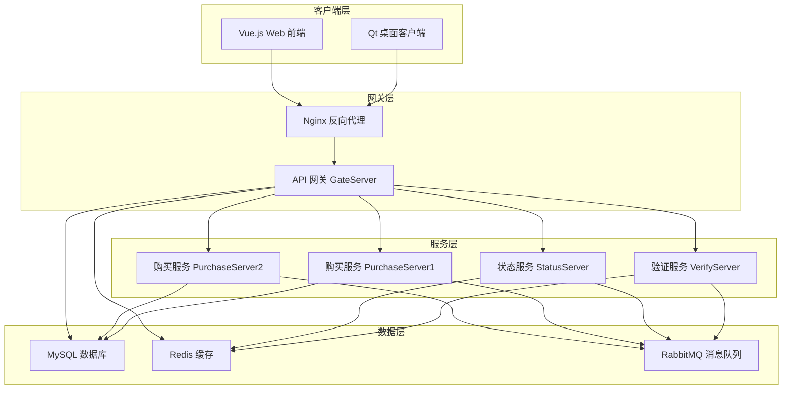

# HungerYet

<div align="center">

</div>

**现代化的餐饮服务系统**

[](https://opensource.org/licenses/MIT)
[](https://isocpp.org/)
[](https://vuejs.org/)
[](https://www.typescriptlang.org/)
[](https://docs.docker.com/compose/)
[](https://grpc.io/)

## 📖 项目简介

HungerYet 是一个现代化的餐饮服务系统，采用微服务架构设计，提供完整的用户认证、状态管理、订单处理等功能。系统使用 C++ 开发后端服务，Qt 开发桌面客户端，Vue.js + TypeScript 开发 Web 前端，并集成了 Nginx 反向代理、RabbitMQ 消息队列和 Swagger API 文档。

### 🎯 设计目标

- **高性能**: 基于 C++ 和 gRPC 的高性能微服务架构
- **可扩展**: 模块化设计，支持水平扩展
- **用户友好**: 提供 Qt 桌面客户端和 Vue.js Web 界面
- **开发友好**: 完整的 API 文档和开发工具链

## ✨ 功能特性

### 🔐 用户管理

- 用户注册、登录、注销
- 邮箱验证码验证
- JWT 令牌认证
- 用户会话管理
- 在线状态追踪

### 🛒 订单系统

- 商品浏览和搜索
- 购物车管理
- 订单创建和支付
- 订单状态实时追踪
- 库存管理和同步

### 🏗️ 系统架构

- 微服务架构设计
- gRPC 同步通信
- RabbitMQ 异步消息
- Redis 缓存加速
- MySQL 数据持久化
- Nginx 反向代理

### 🖥️ 多端支持

- Qt 桌面客户端
- Vue.js Web 前端
- RESTful API 接口
- Swagger API 文档

## 🏗️ 系统架构



### 服务详情

#### 1. API 网关 (GateServer) - 端口 50001

- 🚪 统一的 API 入口点，处理所有外部请求
- ⚖️ 请求路由和负载均衡
- 🔐 用户认证和授权管理
- 🛡️ 请求限流和熔断保护
- 💾 数据库操作（MySQL）和缓存管理（Redis）
- 📝 系统日志发送到 RabbitMQ

#### 2. 验证服务 (VerifyServer) - 端口 50002

- 📧 邮箱验证码生成和发送
- ⏰ 验证码有效期管理
- ✅ 验证码验证和校验
- 🔄 Redis 缓存集成
- 📮 邮件服务集成

#### 3. 状态服务 (StatusServer) - 端口 50003

- 👥 用户会话管理
- 🟢 在线状态追踪
- 🏥 服务健康检查
- ⚖️ 负载均衡策略
- 🔄 实时状态同步

#### 4. 购买服务 (PurchaseServer) - 端口 50004, 50005

- 📦 订单处理和管理
- 💳 支付系统集成
- 📊 库存管理和同步
- 📈 订单状态追踪
- 🔄 双实例部署（高可用）

#### 5. Nginx 反向代理 - 端口 8080

- 🔄 请求转发和路由
- ⚖️ 负载均衡
- 📁 静态资源服务
- 🔒 SSL/TLS 终止
- 📝 访问日志记录

#### 6. Swagger UI - 端口 8081

- 📚 RESTful API 文档
- 🧪 接口在线测试
- 📋 请求/响应示例
- ❌ 错误码说明

#### 7. Web 前端 (Vue.js + TypeScript) - 端口 5174

- 🎨 基于 Vue 3 和 TypeScript 开发
- 📱 响应式设计，支持多设备访问
- 🛒 实时购物车管理
- 📊 订单状态追踪
- 🔐 用户认证和授权
- 🎯 Element Plus UI 组件库

#### 8. 消息队列 (RabbitMQ)

- 📢 订单状态更新通知
- 📝 系统日志收集
- 📧 邮件通知队列
- 🔄 服务间异步通信
- 💾 消息持久化
- 🔌 AMQP 端口：5672
- 🖥️ 管理界面端口：15672

## 🛠️ 技术栈

### 后端技术

- **语言**: C++20
- **框架**: gRPC, Boost
- **数据库**: MySQL 8.0+, Redis 6.0+
- **消息队列**: RabbitMQ 3.10+
- **日志**: spdlog
- **JSON**: jsoncpp
- **网络**: libcurl, hiredis

### 前端技术

- **框架**: Vue 3.5+
- **语言**: TypeScript 5.6+
- **构建工具**: Vite 6.0+
- **路由**: Vue Router 4+
- **状态管理**: Pinia 2.3+
- **UI 组件**: Element Plus 2.9+
- **HTTP 客户端**: Axios 1.7+
- **工具库**: VueUse 12.3+

### 桌面客户端

- **框架**: Qt 5.14.2+
- **图像处理**: OpenCV 4+

### 基础设施

- **容器化**: Docker & Docker Compose
- **反向代理**: Nginx
- **API 文档**: Swagger UI
- **构建工具**: CMake 3.24+

## 📋 环境要求

### 系统要求

- **操作系统**: Ubuntu 22.04+ / CentOS 8+ / macOS 12+ / Windows 10+
- **内存**: 最低 4GB，推荐 8GB+
- **存储**: 最低 10GB 可用空间
- **网络**: 稳定的互联网连接

### 开发环境

- **编译器**: GCC 9.4+ 或 Clang 14.0.0+
- **构建工具**: CMake 3.24+
- **Node.js**: 16.0+ (Web 前端开发)
- **Docker**: 20.10+ (可选，用于容器化部署)

### 依赖库版本

| 组件     | 版本要求 | 用途        |
| -------- | -------- | ----------- |
| Qt       | 5.14.2+  | GUI框架     |
| libcurl  | 7.80.0+  | 网络请求    |
| OpenCV   | 4.0+     | 图像处理    |
| hiredis  | 1.0.3+   | Redis客户端 |
| spdlog   | 1.10.0+  | 日志库      |
| jsoncpp  | 1.9.5+   | JSON解析    |
| MySQL    | 8.0.34+  | 数据库      |
| Redis    | 6.0.16+  | 缓存        |
| Boost    | 1.82.0+  | 基础库      |
| protobuf | 3.13+    | 序列化      |
| gRPC     | 1.50.0+  | RPC框架     |
| RabbitMQ | 3.10.0+  | 消息队列    |

## 🚀 快速开始

### 方式一：自动化脚本部署（推荐）

```bash
# 1. 克隆项目
git clone https://github.com/KBchulan/HungerYet.git
cd HungerYet

# 2. 安装依赖（Ubuntu/Debian）
sudo apt update
sudo apt install -y build-essential cmake git nodejs npm

# 3. 安装开发库
sudo apt install -y \
    libboost-all-dev \
    libmysqlclient-dev \
    libhiredis-dev \
    libgrpc++-dev \
    libprotobuf-dev \
    protobuf-compiler-grpc \
    libjsoncpp-dev \
    libspdlog-dev \
    qt5-default \
    libopencv-dev

# 4. 启动所有服务（按顺序执行）
cd scripts

# 启动验证服务
./aVarify.sh

# 启动 API 网关
./bGateServerCompile.sh

# 启动状态服务
./bStatusCompile.sh

# 启动购买服务（双实例）
./b1PucharseServerCompile.sh
./b2PucharseServerCompile.sh

# 启动 Web 前端
./aWeb.sh

# 启动 Docker 服务（Nginx + Swagger）
./bDocker.sh

# 启动 Qt 客户端（可选）
./bCmakeClientCompile.sh
```

### 方式二：Docker Compose 部署

```bash
# 1. 克隆项目
git clone https://github.com/KBchulan/HungerYet.git
cd HungerYet

# 2. 启动基础服务
docker-compose up -d

# 3. 手动启动后端服务（需要先安装依赖）
cd scripts
./aVarify.sh
./bGateServerCompile.sh
./bStatusCompile.sh
./b1PucharseServerCompile.sh
./b2PucharseServerCompile.sh

# 4. 启动 Web 前端
./aWeb.sh
```

### 🔍 验证部署

部署完成后，您可以通过以下方式验证服务状态：

| 服务          | 访问地址               | 说明             |
| ------------- | ---------------------- | ---------------- |
| Web 前端      | http://localhost:5174  | Vue.js 用户界面  |
| API 网关      | http://localhost:8080  | Nginx 反向代理   |
| API 文档      | http://localhost:8081  | Swagger UI 文档  |
| RabbitMQ 管理 | http://localhost:15672 | 消息队列管理界面 |

## 📁 项目结构

```
HungerYet/
├── 📁 client/                    # Qt 桌面客户端
│   ├── 📁 src/                  # 源代码
│   ├── 📁 include/              # 头文件
│   ├── 📁 ui/                   # 界面文件
│   └── 📄 CMakeLists.txt        # CMake 构建配置
├── 📁 web/                      # Vue.js Web 前端
│   ├── 📁 src/                  # 源代码
│   │   ├── 📁 components/       # Vue 组件
│   │   ├── 📁 views/            # 页面视图
│   │   ├── 📁 stores/           # Pinia 状态管理
│   │   ├── 📁 router/           # 路由配置
│   │   └── 📁 utils/            # 工具函数
│   ├── 📁 public/               # 静态资源
│   ├── 📄 package.json          # npm 依赖配置
│   ├── 📄 vite.config.ts        # Vite 构建配置
│   └── 📄 tsconfig.json         # TypeScript 配置
├── 📁 server/                   # 后端服务
│   ├── 📁 GateServer/           # API 网关服务
│   ├── 📁 VarifyServer/         # 验证服务
│   ├── 📁 StatusServer/         # 状态服务
│   ├── 📁 PurchaseServer1/      # 购买服务实例1
│   ├── 📁 PurchaseServer2/      # 购买服务实例2
│   └── 📁 RabbitMq/             # 消息队列配置
├── 📁 proto/                    # gRPC 协议定义
├── 📁 nginx/                    # Nginx 配置
│   ├── 📄 nginx.conf            # 主配置文件
│   ├── 📁 html/                 # 静态资源
│   └── 📁 logs/                 # 日志文件
├── 📁 scripts/                  # 启动和构建脚本
│   ├── 📄 aVarify.sh            # 验证服务启动脚本
│   ├── 📄 bGateServerCompile.sh # 网关服务编译脚本
│   ├── 📄 aWeb.sh               # Web 前端启动脚本
│   └── 📄 bDocker.sh            # Docker 服务启动脚本
├── 📁 doc/                      # 项目文档
│   ├── 📄 details.md            # 详细设计文档
│   ├── 📄 results.md            # 测试结果文档
│   └── 📁 定档文档/             # 最终文档
├── 📄 docker-compose.yaml       # Docker 编排配置
├── 📄 swagger.yaml              # API 文档定义
├── 📄 README.md                 # 项目说明文档
├── 📄 LICENSE                   # MIT 许可证
└── 📄 .gitignore                # Git 忽略配置
```

### 📝 日志管理

系统使用 **spdlog** 进行统一的日志管理：

- **日志级别**: DEBUG, INFO, WARN, ERROR
- **日志轮转**: 自动按大小和时间轮转
- **日志归档**: 压缩存储历史日志

## 📚 API 文档

### 在线文档

访问 [http://localhost:8081](http://localhost:8081) 查看完整的 Swagger API 文档。

### 主要 API 端点

#### 用户认证

```http
POST /api/auth/register    # 用户注册
POST /api/auth/login       # 用户登录
POST /api/auth/logout      # 用户登出
POST /api/auth/verify      # 邮箱验证
```

#### 订单管理

```http
GET    /api/orders         # 获取订单列表
POST   /api/orders         # 创建新订单
GET    /api/orders/{id}    # 获取订单详情
PUT    /api/orders/{id}    # 更新订单状态
DELETE /api/orders/{id}    # 取消订单
```

#### 商品管理

```http
GET    /api/products       # 获取商品列表
GET    /api/products/{id}  # 获取商品详情
POST   /api/cart/add       # 添加到购物车
DELETE /api/cart/{id}      # 从购物车移除
```

### 错误码说明

| 错误码 | 说明         | 解决方案     |
| ------ | ------------ | ------------ |
| 1001   | 用户未认证   | 请先登录     |
| 1002   | 权限不足     | 联系管理员   |
| 2001   | 商品不存在   | 检查商品ID   |
| 2002   | 库存不足     | 减少购买数量 |
| 3001   | 订单不存在   | 检查订单ID   |
| 3002   | 订单状态错误 | 检查订单状态 |

## 📊 性能指标

### 基准测试结果

| 指标       | 数值     | 说明             |
| ---------- | -------- | ---------------- |
| 并发用户数 | 1000+    | 同时在线用户     |
| 响应时间   | <20ms    | API 平均响应时间 |
| 吞吐量     | 50k QPS | 每秒查询数       |
| 可用性     | 99.9%    | 系统可用性       |

### 资源使用

| 组件           | CPU  | 内存  | 磁盘  |
| -------------- | ---- | ----- | ----- |
| GateServer     | <10% | 256MB | 1GB   |
| VerifyServer   | <5%  | 128MB | 500MB |
| StatusServer   | <5%  | 128MB | 500MB |
| PurchaseServer | <15% | 512MB | 2GB   |
| Web Frontend   | -    | -     | 100MB |

## 📄 许可证

本项目采用 [MIT 许可证](LICENSE) - 查看 LICENSE 文件了解详情。

```
MIT License

Copyright (c) 2024 KB初岚

Permission is hereby granted, free of charge, to any person obtaining a copy
of this software and associated documentation files (the "Software"), to deal
in the Software without restriction, including without limitation the rights
to use, copy, modify, merge, publish, distribute, sublicense, and/or sell
copies of the Software, and to permit persons to whom the Software is
furnished to do so, subject to the following conditions:

The above copyright notice and this permission notice shall be included in all
copies or substantial portions of the Software.

THE SOFTWARE IS PROVIDED "AS IS", WITHOUT WARRANTY OF ANY KIND, EXPRESS OR
IMPLIED, INCLUDING BUT NOT LIMITED TO THE WARRANTIES OF MERCHANTABILITY,
FITNESS FOR A PARTICULAR PURPOSE AND NONINFRINGEMENT. IN NO EVENT SHALL THE
AUTHORS OR COPYRIGHT HOLDERS BE LIABLE FOR ANY CLAIM, DAMAGES OR OTHER
LIABILITY, WHETHER IN AN ACTION OF CONTRACT, TORT OR OTHERWISE, ARISING FROM,
OUT OF OR IN CONNECTION WITH THE SOFTWARE OR THE USE OR OTHER DEALINGS IN THE
SOFTWARE.
```

## 👥 维护者

<table>
  <tr>
    <td align="center">
      <a href="https://github.com/KBchulan">
        
        <br />
        <sub><b>KB初岚</b></sub>
      </a>
      <br />
      <sub>项目创建者 & 主要维护者</sub>
    </td>
    <td align="center">
      <a href="https://github.com/fgloris">
        
        <br />
        <sub><b>fgloris</b></sub>
      </a>
      <br />
      <sub>核心贡献者</sub>
    </td>
  </tr>
</table>

## 🙏 致谢

感谢以下开源项目和社区的支持：

- [Vue.js](https://vuejs.org/) - 渐进式 JavaScript 框架
- [gRPC](https://grpc.io/) - 高性能 RPC 框架
- [Qt](https://www.qt.io/) - 跨平台应用开发框架
- [Element Plus](https://element-plus.org/) - Vue 3 组件库
- [spdlog](https://github.com/gabime/spdlog) - 快速 C++ 日志库
- [RabbitMQ](https://www.rabbitmq.com/) - 消息队列中间件

## 📞 联系我们

- **项目主页**: https://github.com/KBchulan/HungerYet
- **问题反馈**: https://github.com/KBchulan/HungerYet/issues
- **讨论区**: https://github.com/KBchulan/HungerYet/discussions

---

**如果这个项目对您有帮助，请给我们一个 ⭐ Star！**

Made with ❤️ by [KB初岚](https://github.com/KBchulan) and [contributors](https://github.com/KBchulan/HungerYet/graphs/contributors)
