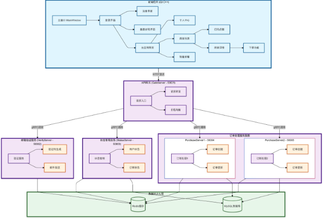
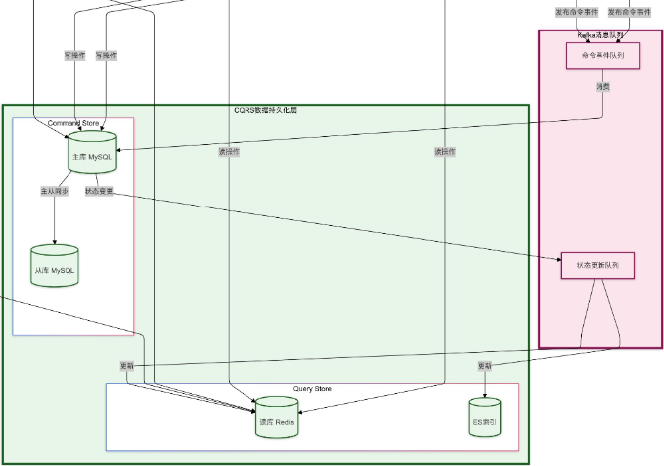
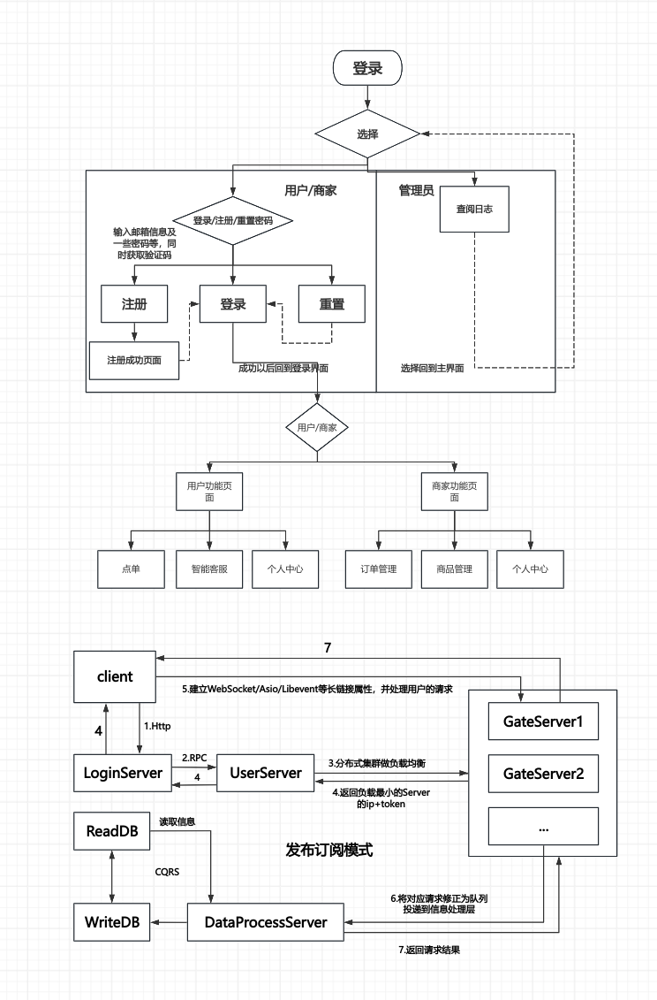

**中南饿了么（Hunger Yet）详细设计文档**

欢迎来到中南饿了么（Hunger Yet）的详细设计资源页面。本资源是专为那些致力于开发、改进或理解中南饿了么核心架构和流程的开发者、项目管理者以及质量保证专业人员准备的宝贵资料。

## 文档概述

作为我们组的开发文档，方便后续开发。

## 目标受众

**平台运营方**：通过对用户的行为，销售数据进行分析，为产品迭代和市场策略提供支持。

- **消费者（用户）**：主要针对大学生以及高校社区，以及特殊饮食需求人群以便他们寻找符合自己饮食需要的食品。
- **商家**：中小型餐馆和快餐店，便利店和超市，新型餐饮企业，特殊饮食需求的专门店等等。

## 内容概览

1. **引言**

**系统背景**: 随着移动互联网的快速发展，外卖订餐已经成为大学校园中学生日常生活的重要组成部分。然而，目前市面上的外卖平台大多针对社会化商业环境设计，对校园场景的特殊需求考虑不足。为了更好地服务校园师生，提供更加便捷、安全和个性化的订餐体验，开发一个专门面向校园的订餐系统具有重要意义。

**系统目的**: HungerYet项目旨在构建一个现代化的校园订餐系统，通过整合多种先进技术，为校园用户提供全方位的订餐服务。系统具体目标包括：

(1).提供便捷的用户注册和身份验证机制

(2).实现商家信息的高效浏览和展示

(3).支持多样化的点餐方式，包括常规点餐和二维码扫描点餐

1. .建立智能客服系统，提供及时的用户支持,确保订单处理的可靠性和系统的高可用性

**系统范围**

本系统采用分布式微服务架构，包含以下主要组件：

客户端

基于Qt5开发的跨平台桌面应用

支持主题切换的现代化UI设计

集成OpenCV实现二维码扫描功能

服务端

API网关服务 (GateServer)

邮箱验证服务 (VerifyServer)

状态管理服务 (StatusServer)

订单处理服务 (PurchaseServer1/2)

系统支持的核心功能涵盖用户管理、商家信息浏览、菜品订购、订单管理、二维码扫描点餐以及智能客服对话等方面，为校园用户提供完整的订餐服务解决方案。

1. **需求分析** - 业务需求、用户故事和技术需求的梳理。
   
2. **系统架构** - 总体架构图、技术选型与框架解释。

前端

使用Qt5开发的跨平台桌面客户端

OpenCV实现二维码扫描支持两种主题切换的现代化UI设计

后端微服务

GateServer (50001): API网关服务

VerifyServer (50002): 邮箱验证服务

StatusServer (50003): 状态管理服务

PurchaseServer1 (50004): 订单处理服务1

PurchaseServer2 (50005): 订单处理服务2

1. **模块设计** - 核心模块分解，各模块职责与交互方式。

graph TB

subgraph "HungerYet系统模块总架构"
    A["用户交互层"] --> B["业务逻辑层"]
    B --> C["数据服务层"] 
    C --> D["基础设施层"]
end

subgraph "用户交互层"
    B1["用户界面模块"]
    B2["用户管理模块"]
    B1 --> B11["主界面管理"]
    B1 --> B12["页面导航"]
    B2 --> B21["注册登录"]
    B2 --> B22["权限控制"]
end

subgraph "业务逻辑层"
    C1["订单处理模块"]
    C2["支付服务模块"]
    C3["商家服务模块"]
    C1 --> C11["订单创建"]
    C1 --> C12["订单追踪"]
    C2 --> C21["支付流程"]
    C2 --> C22["退款处理"]
    C3 --> C31["商家入驻"]
    C3 --> C32["菜单管理"]
end

subgraph "数据服务层"
    D1["数据持久化模块"]
    D2["缓存管理模块"]
    D1 --> D11["数据存储"]
    D1 --> D12["数据查询"]
    D2 --> D21["缓存设置"]
    D2 --> D22["缓存获取"]
end

subgraph "基础设施层"
    E1["日志模块"]
    E2["安全认证模块"]
    E1 --> E11["普通日志"]
    E1 --> E12["错误日志"]
    E2 --> E21["Token生成"]
    E2 --> E22["Token验证"]
end

subgraph "模块交互机制"
    F1["依赖注入"]
    F2["事件驱动"]
    F3["消息队列"]
    F4["接口回调"]
end

subgraph "系统扩展策略"
    G1["插件化架构"]
    G2["微服务解耦"]
    G3["配置化管理"]
    G4["动态加载"]
end

subgraph "性能优化策略"
    H1["异步处理"]
    H2["多线程设计"]
    H3["连接池"]
    H4["缓存策略"]
end

1. **数据设计** - 数据库模式设计、表结构和关系图。

期望成为CQRS的分布式数据库，目前还只是微服务的单数据库，大体如下图所示，退而求其次保有三张表user(uid, name, email)，id, merchants(储存购买数据)：

1. **流程设计** - 关键业务流程图及逻辑说明。
   

**系统核心逻辑**

**用户端**

1. 登录/注册 → 邮箱验证 → 进入系统
2. 浏览商家 → 选择菜品 → 提交订单
3. 查看订单 → 确认收货 → 完成交易

**服务端**

1. GateServer统一接收请求并分发
2. VerifyServer处理验证码
3. StatusServer管理用户状态
4. PurchaseServer处理订单(双机部署)

**数据存储**

1. Redis缓存临时数据(验证码、会话)
2. MySQL持久化存储(用户、订单、商家)

**特点**

1. 分布式架构保证高可用
2. Token机制确保安全
3. 多级缓存提升性能
4. **接口设计** - 第三方系统集成、API设计规范。

graph LR;

root["HungerYet系统接口设计"]

root-->系统集成接口

root-->微服务接口

root-->API设计规范

root-->安全设计

root-->性能与可靠性

root-->监控与告警

系统集成接口-->支付系统接口

系统集成接口-->短信验证码接口

支付系统接口-->创建支付订单

支付系统接口-->支付回调验证

支付系统接口-->退款处理

短信验证码接口-->发送验证码

短信验证码接口-->验证码校验

微服务接口-->用户服务接口

微服务接口-->订单服务接口

用户服务接口-->用户注册

用户服务接口-->用户登录

用户服务接口-->更新用户信息

订单服务接口-->创建订单

订单服务接口-->更新订单状态

订单服务接口-->获取用户订单

API设计规范-->通用响应结构

API设计规范-->错误码定义

通用响应结构-->状态码

通用响应结构-->响应消息

通用响应结构-->响应数据

错误码定义-->系统级错误码

错误码定义-->业务级错误码

安全设计-->Token管理

安全设计-->权限控制

Token管理-->生成JWT_Token

Token管理-->验证Token

Token管理-->刷新Token

权限控制-->用户角色定义

权限控制-->权限检查机制

性能与可靠性-->请求超时处理

性能与可靠性-->错误重试机制

监控与告警-->接口调用链路追踪

监控与告警-->性能指标监控

监控与告警-->异常告警机制

1. **安全与性能考量** - 安全机制、数据保护与系统性能优化。

安全机制：服务器端采取微服务架构，借助protobuf统一接口，各个服务器不会链式崩溃，能够独立发挥作用;

数据保护：用数据库做持久化与本地文件校验，实现长生命周期

系统性能优化：Dao层采用服务池，满足高并发，同时StatusServer对长连接服务器进行负载均衡。

1. ***部署与维护**

- GCC 9.4+

- Clang 14.0.0+

- CMake 3.24+

- Qt 5.14.2+

- Node.js 22.11+

- OpenCV 4+

- Boost 1.82.0+

- protobuf 3.13+

- gRPC 1.50.0+

- hiredis 1.0.3+

- spdlog 1.10.0+

- jsoncpp 1.9.5+

- libcurl 7.80.0+

- MySQL 8.0.34+

- Redis 6.0.16+

10. **附录** - v1.0.0， v1.0.1，v1.1.0

## 获取资源

---

加入我们的开源社区，一起构建我们中南自己的、更高质量的外卖软件产品！通过深入学习这份详细设计文档，相信您能够更好地理解和实现一个高效、合规的外卖订单系统。
